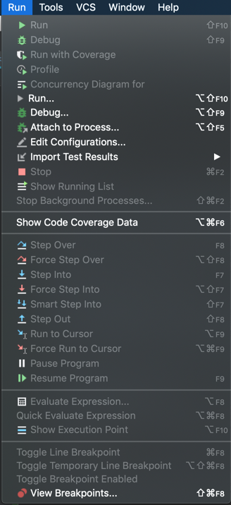
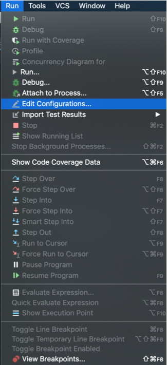
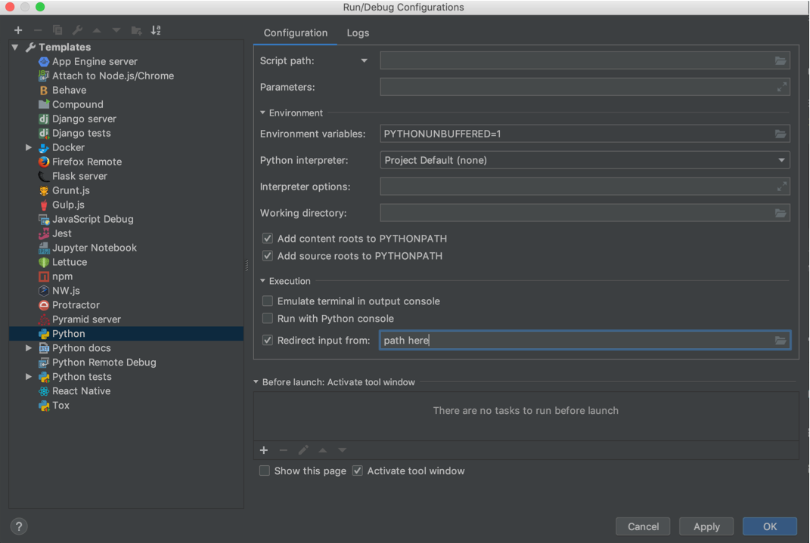
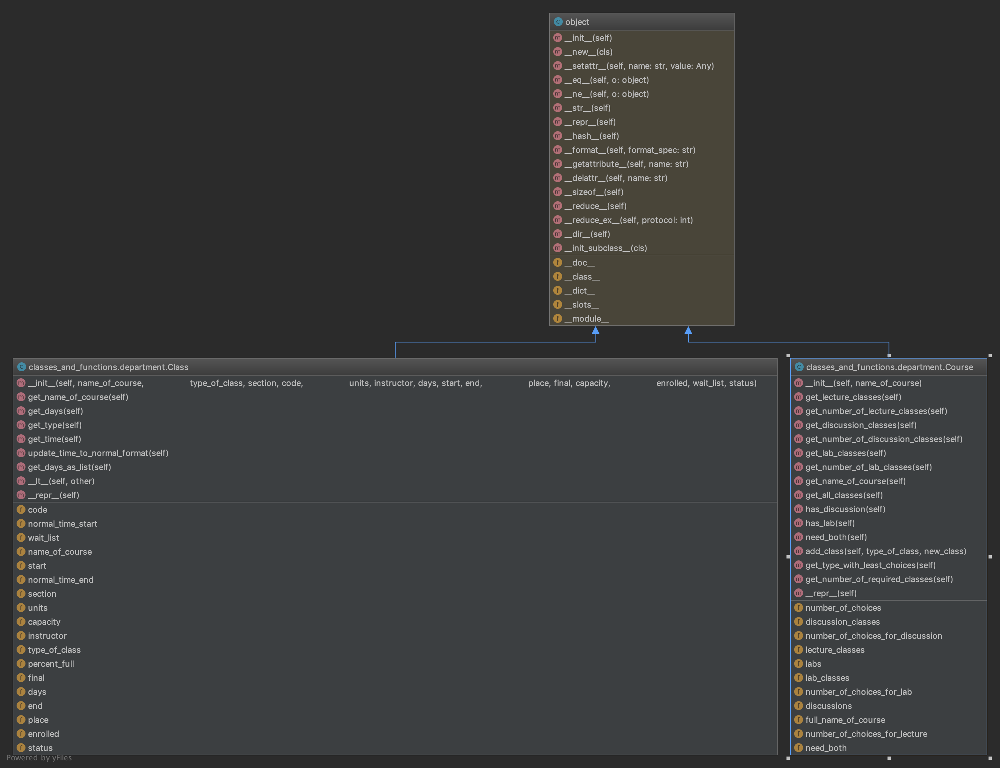
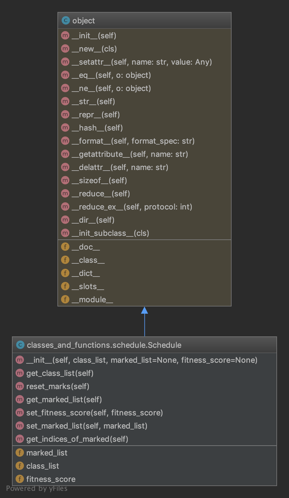
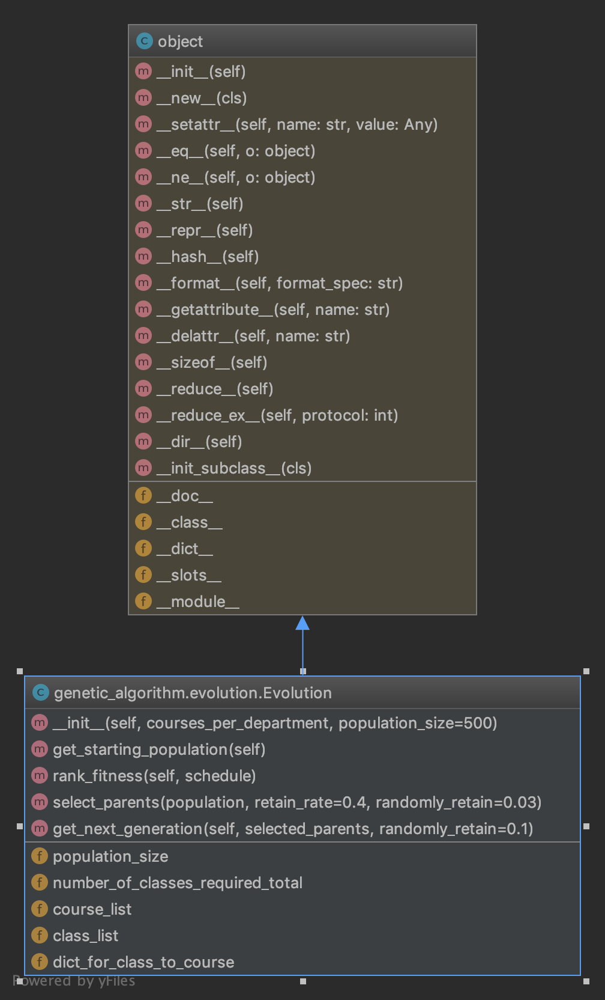
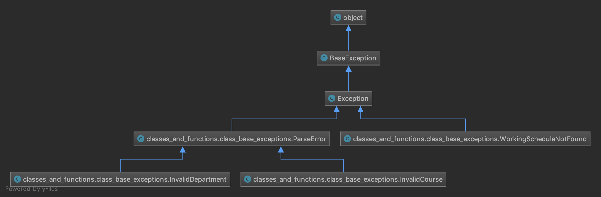

# Class-Base
_Class-Base_ is a small project that involves web-scraping and and the use of a Genetic Algorithm for schedule optimization.
The script helps to generate different class schedules for students at the University of California, Irvine.

This project was mainly created as a way for me (Kevin) to learn more about Python as well as exploring different modules
and algorithms frequently used in practice.

## Getting Started
### Prerequisites
_Class-Base_ makes use of several open source modules to make web-scraping and text parsing simpler. In addition,
because _Class-Base_ uses the _Selenium Webdriver_, out-of-the-box, _Class-Base_ only supports
either Windows 10 or MacOS, with _Google Chrome_. 

#### Dependencies
+ [BeautifulSoup4](https://www.crummy.com/software/BeautifulSoup/bs4/doc/) - is used in _Class-Base_
as a way to parse HTML text from the UCI class search page.
> "Beautiful Soup is a Python library for pulling data out of HTML and XML files."
+ [Selenium](https://www.seleniumhq.org/projects/webdriver/) - is used in _Class-Base_ as a way to navigate
through JavaScript rendered web pages while web-scraping.
> "Selenium is an open source tool which is used for automating the tests carried out on web browsers (Web applications are tested using any web browser)."
+ [NumPy](http://www.numpy.org/) - because _Class-Base_ makes use of a Genetic Algorithm for optimizing
class schedules, probability and randomization functions from NumPy are used. 
> "NumPy is the fundamental package for scientific computing in Python."

*To install these modules, paste the following lines into a command line*
~~~~
pip install beautifulsoup4
~~~~
~~~~
pip install selenium
~~~~
~~~~
pip install numpy
~~~~

### Running
After installing the required modules to run _Class-Base_, it is fairly simple to run. The script uses standard text files to
communicate between user and script. The most difficult part of setting up would be properly formatting
the text file. For any desired class schedule you must do the following:
1. **Set up a text file that lists the department code and classes.**

    *Formatting for this text file is extremely sensitive (pay attention to spaces and commas)*. When entering the list of departments (first line of text), see the _departments.txt_
    file that is found in the _help_ directory, for exact names of departments. After typing out the departments
    that the desired classes are in, you can enter in the class names, respective to the order of entered departments.
    The formatting is as follows:
    ~~~~
    DEPARTMENT1,DEPARTMENT2,DEPARTMENT-X
    Course1_for_Department1, Course2_for_Department2, CourseX_for_Department1
    Course1_for_Department2, Course2_for_Department2, CourseX_for_Department2
    Course1_for_DepartmentX, Course2_for_DepartmentX, CourseX_for_DepartmentX
    ~~~~
2. **Edit configurations to automate passing text arguments to the command line**

    This process may vary depending on your IDE; however, if you are using PyCharm by JetBrains, you can achieve this
    by following these steps:
    1. Click on the _Run_ tab
    2. Select the option that says _Edit Configurations..._
    3. Under _Template_ -> _Python_ check the box that says _Redirect input from_ and select or enter in
        the path to the desired department/classes text file
        
3. **Run _main.py_**

    Once you run _main.py_, the script will (with correct formatting/configurations) web-scrape data from the UCI
    class search and then use a Genetic Algorithm to optimize schedules until finding a complete one. Once it finds several complete schedules
    it will output the schedules into a text file named _class_schedule.txt_.
    
(P.s. It should also be noted that instead of doing step 1 and 2, you can just run the _main.py_
and type what you would normally put in the desired department/class text file. Keep in mind though, that still
formatting of the spaces and commas are still sensitive)

#### Examples
1. For setting up a file, you can view an example in the _help_ directory, named _test_arguments.txt_ or look at the following:
    ~~~~
    I&C SCI,STATS,COMPSCI
    51, 139W
    67
    161
    ~~~~

2. Steps to set up the configurations to automate passing text arguments:

    1. 
    2. 
    3. 

## Contributing
Anybody can contribute to this project to make it better. There are many features that would make this script more usable such as:
1. Exporting to an Excel-Sheet that is programmed to display schedules visually
2. Better handling the I/O of selecting desired classes to scrape for
3. Add support for prioritizing professors during selection process
4. Take into account _RateMyProfessor_ reviews
5. There is already a pre-formatted excel sheet to handle visualizing a schedule; however,
    when outputting to this while using openpyxl, the write function does not properly update/recalculate the cell

To contribute, just clone or fork the repository and request to merge it.

### Directories/Files
1. *classes_and_functions* - contains functions and classes used by _Class-Base_.
    1. _class_base_exceptions.py_ - is a *.py file that contains all of the exceptions used by _Class-Base_.    
    2. _department.py_ - is a *.py file that contains two classes and their implementation, _Course_ and _Class_.   
    3. _export_classes.py_ - is a *.py file that handles exporting schedules after they have been found.    
    4. _schedule.py_ - is a *.py file that implements the Schedule class, this is used in the Genetic Algorithm implementation.
    
2. *genetic_algorithm* - contains functions and classes used to run a Genetic Algorithm on classes.
    1. _class_schedule_solver.py_ - is a *.py file that abstracts schedule optimization, i.e. all Genetic Algorithm
    functions run in this file.   
    2. _evolution.py_ - is a *.py file that mimics natural selection functions used in schedule
    optimization.
    
3. *help* - contains help/examples for running the script.
    1. _departments.txt_ - contains all department codes.
    2. _format_of_argument_file.txt_ - contains the format for creating a desired class *.txt file.
    3. _test_arguments_ - an example of a desired class arguments *.txt file.

4. *scrape* - contains all of the *.py files used in web-scraping the UCI class search for classes.
    1. _class_parser.py_ - parses an HTML page (classes page) and organizes the data into a _Class_ data structure.
    2. _class_scraper.py_ - navigates through the JavaScript rendered UCI page and selects classes to be scraped.
    3. _web_navigation.py_ - used to reuse some _Selenium_ navigation code.
    
5. *web_drivers* - holds the web drivers used by _Selenium_.
    1. chromedriver (MacOS)
    2. chromedriver.exe (Windows)
    
#### UML Class Diagram(s)

### Flow
Essentially the flow can be followed by tracing the main.
1. Web-Scrape classes from the UCI class search using the _Selenium Webdriver_, then organize it into data structures.
2. Pass the organized _Course/Class_ objects to the _class_schedule_solver_.
3. Use the genetic algorithm (_Evolution class_), to find complete schedules.
4. Output the complete schedules to text files using _export_classes_.

## Authors
+ Kevin Ngo (so far)
